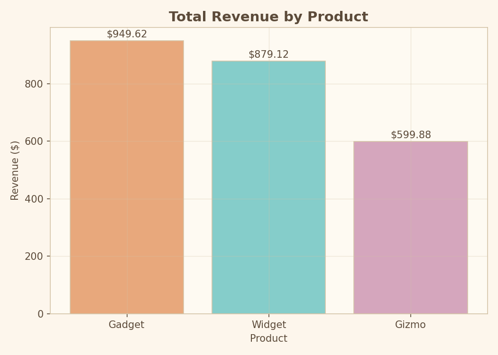
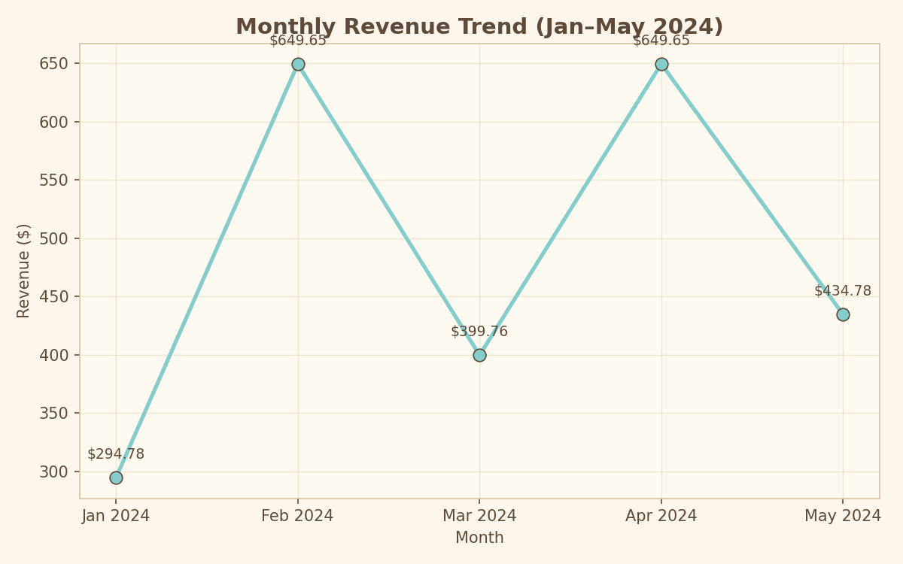
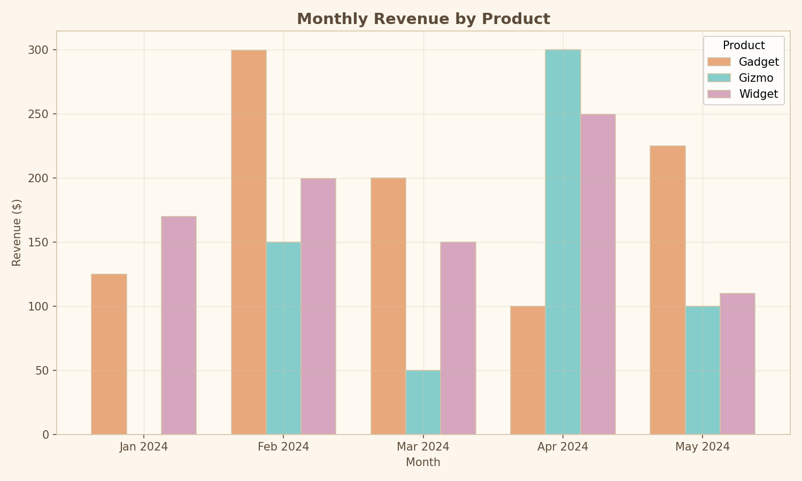
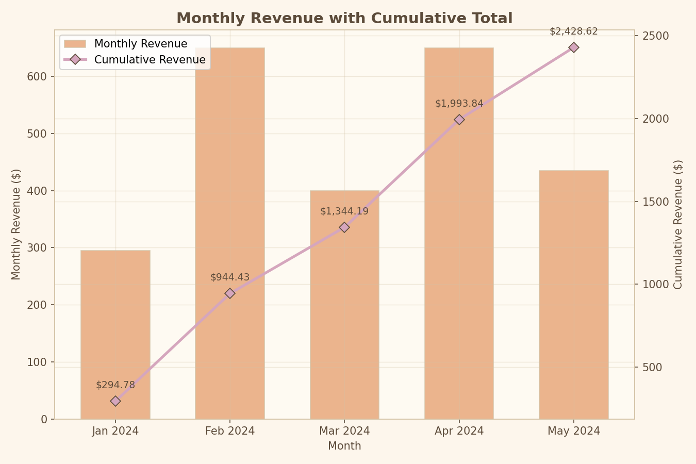
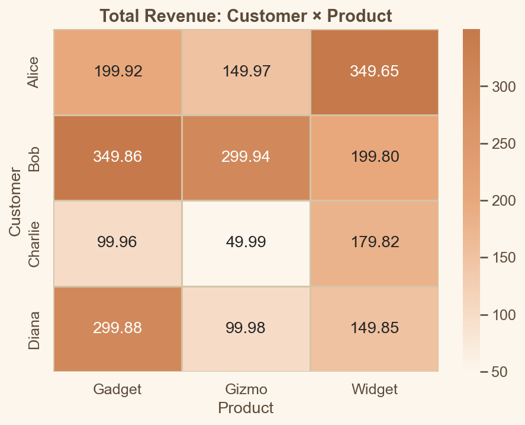
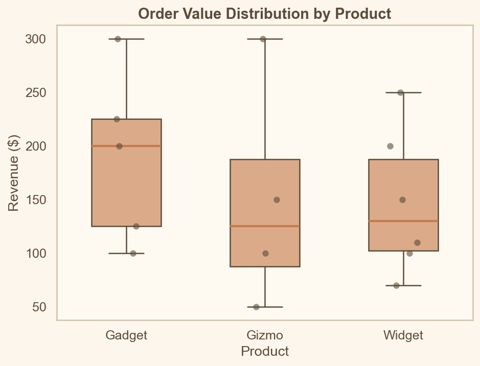

# duckdb-demo

Hands-on DuckDB + Python demo for novice AI/BI developers.

Learn practical data querying, transformation, and analysis using DuckDB's
in-process SQL engine -- no database server required. **42 self-contained
example scripts** organized into **8 progressive tracks**, from first query
to production-grade ETL.

## Prerequisites

- Python 3.10+
- [uv](https://docs.astral.sh/uv/) -- package manager and task runner
- [Task](https://taskfile.dev/) -- task runner (optional, for convenience commands)

## Quick start

```sh
uv sync                # install dependencies
task run               # lint/format, then run the main demo
```

Or without Task:

```sh
uv sync
uv run python -m duckdb_demo.main
```

Run any example directly:

```sh
uv run python examples/11_quick_start.py   # first example
uv run python examples/85_query_profiling.py  # last example
```

## Learning tracks

The examples are organized into 8 progressive tracks. Each script is
self-contained -- run it, read the output, study the code.

### Track 1 -- Foundations

Get data in, run your first queries, zero infrastructure.

| # | Example | What you learn |
|---|---------|----------------|
| 11 | `11_quick_start.py` | `duckdb.sql()`, `read_csv()`, `GROUP BY`, `SUM` |
| 12 | `12_excel_to_duckdb.py` | `read_xlsx()`, persistent `.duckdb` file |
| 13 | `13_read_parquet.py` | `read_parquet()`, column pruning, metadata inspection |
| 14 | `14_read_json.py` | `read_json()`, nested fields, JSONL format |
| 15 | `15_create_and_insert.py` | `CREATE TABLE`, `INSERT INTO`, data types |

### Track 2 -- Core SQL

The SQL you will use every single day.

| # | Example | What you learn |
|---|---------|----------------|
| 21 | `21_filter_and_sort.py` | `WHERE`, `ORDER BY`, `LIMIT`, `BETWEEN`, `LIKE` |
| 22 | `22_aggregations.py` | `GROUP BY`, `HAVING`, `COUNT`, `AVG`, `SUM` |
| 23 | `23_joins.py` | `INNER`, `LEFT`, `RIGHT`, `FULL`, `CROSS`, `ANTI` joins |
| 24 | `24_subqueries_ctes.py` | Subqueries, `WITH` (CTEs), correlated subqueries |
| 25 | `25_case_expressions.py` | `CASE WHEN`, `COALESCE`, `NULLIF`, conditional logic |
| 26 | `26_set_operations.py` | `UNION`, `INTERSECT`, `EXCEPT` |

### Track 3 -- Intermediate SQL

Window functions, dates, strings, PIVOT, and DuckDB-specific features.

| # | Example | What you learn |
|---|---------|----------------|
| 31 | `31_window_ranking.py` | `ROW_NUMBER`, `RANK`, `DENSE_RANK`, `NTILE` |
| 32 | `32_window_aggregates.py` | `SUM/AVG OVER`, running totals, moving averages |
| 33 | `33_dates_and_times.py` | `date_trunc`, `date_part`, intervals, `strftime` |
| 34 | `34_strings_and_regex.py` | `LIKE`, `regexp_matches`, `string_split`, `TRIM` |
| 35 | `35_pivot_unpivot.py` | `PIVOT`, `UNPIVOT`, cross-tab tables |
| 36 | `36_friendly_sql.py` | `EXCLUDE`, `REPLACE`, `COLUMNS(*)`, `QUALIFY` |

### Track 4 -- Data I/O & Export

Read from anywhere, write to anything.

| # | Example | What you learn |
|---|---------|----------------|
| 41 | `41_export_formats.py` | `COPY TO` CSV, Parquet, JSON |
| 42 | `42_multi_file_glob.py` | Glob patterns, `read_csv('*.csv')` |
| 43 | `43_hive_partitioning.py` | `PARTITION_BY`, Hive-style directory layout |
| 44 | `44_http_remote.py` | `httpfs` extension, querying remote files |
| 45 | `45_attach_databases.py` | `ATTACH`, cross-database queries |

### Track 5 -- Python Interop

DuckDB + pandas, polars, pyarrow, and Python UDFs.

| # | Example | What you learn |
|---|---------|----------------|
| 51 | `51_pandas_interop.py` | `.df()`, `FROM df`, zero-copy exchange |
| 52 | `52_polars_interop.py` | `.pl()`, polars LazyFrame integration |
| 53 | `53_pyarrow_interop.py` | `.arrow()`, Arrow tables, zero-copy |
| 54 | `54_relational_api.py` | `duckdb.sql().filter().aggregate()` chaining |
| 55 | `55_python_udfs.py` | `CREATE FUNCTION`, Python UDFs in SQL |

### Track 6 -- Advanced SQL

Nested data, full-text search, and DuckDB power features.

| # | Example | What you learn |
|---|---------|----------------|
| 61 | `61_nested_types.py` | `STRUCT`, `LIST`, `MAP`, `unnest()` |
| 62 | `62_json_processing.py` | `json_extract`, `json_transform`, JSON type |
| 63 | `63_recursive_ctes.py` | `WITH RECURSIVE`, tree traversal, hierarchy flattening |
| 64 | `64_asof_joins.py` | `ASOF JOIN`, time-series alignment |
| 65 | `65_grouping_sets.py` | `GROUPING SETS`, `ROLLUP`, `CUBE`, subtotals |
| 66 | `66_full_text_search.py` | `fts` extension, BM25 ranking |

### Track 7 -- Visualization

Query with DuckDB, chart with Python. All charts use a warm, paper-tinted
aesthetic with pastel colors.

| # | Example | What you learn |
|---|---------|----------------|
| 71 | `71_matplotlib_charts.py` | Bar, line, grouped bar, combined bar+line |
| 72 | `72_plotly_charts.py` | Interactive HTML charts, scatter, sunburst |
| 73 | `73_seaborn_plots.py` | Statistical plots, heatmaps, faceted grids |
| 74 | `74_chart_ready_data.py` | PIVOT/UNPIVOT for BI tools, star schema |

### Track 8 -- Real-World Patterns

Patterns you will use on every analytics project.

| # | Example | What you learn |
|---|---------|----------------|
| 81 | `81_etl_pipeline.py` | Extract CSV+JSON, transform, load Parquet, verify |
| 82 | `82_data_quality.py` | `SUMMARIZE`, NULL checks, outlier flagging, quality score |
| 83 | `83_deduplication.py` | `ROW_NUMBER+QUALIFY`, `DISTINCT ON`, fuzzy dedup, audit trail |
| 84 | `84_synthetic_data.py` | `generate_series()`, `random()`, `uuid()`, test data |
| 85 | `85_query_profiling.py` | `EXPLAIN ANALYZE`, reading query plans, profiling |

## Sample chart output

All visualization examples (Track 7) produce charts with a warm, creamy,
paper-tinted background and pastel data colors. Here are some examples:

### Revenue by product (matplotlib bar chart)



### Monthly revenue trend (matplotlib line chart)



### Monthly revenue by product (matplotlib grouped bar)



### Revenue bars + cumulative line (matplotlib combined)



### Customer x product heatmap (seaborn)



### Order value distributions (seaborn box + strip)



## Project layout

```
src/duckdb_demo/
  __init__.py          # package metadata
  __main__.py          # python -m entry point
  main.py              # CLI runner -- walks through demo queries
  queries.py           # reusable SQL queries and helpers
  data/
    sales.csv          # sample sales dataset (CSV)
    sales.parquet      # same data in Parquet format
    inventory.xlsx     # sample inventory dataset (Excel)
    products.jsonl     # sample products (nested JSON)
examples/
  11_quick_start.py    # Track 1 starts here
  ...
  85_query_profiling.py # Track 8 ends here (42 examples total)
  output/              # generated charts (gitignored)
docs/
  rationale/           # design rationale docs per track
  images/              # chart screenshots for README
Taskfile.yml           # task definitions
pyproject.toml         # project config, ruff + ty settings
```

## Available tasks

Run `task` (or `task --list-all`) to see everything:

| Task | Description |
|---|---|
| `task run` | Auto-fix lint/format, then run the main demo |
| `task run:example -- <file>` | Run a standalone example script |
| `task run:track1` ... `task run:track8` | Run all examples in a track |
| `task run:all-tracks` | Run all example tracks (1-8) sequentially |
| `task fmt` | Auto-format with ruff |
| `task lint` | Lint + auto-fix with ruff |
| `task typecheck` | Type-check with ty |
| `task check` | Run all quality checks (lint, format, type-check) |
| `task loc` | Lines of code summary (requires tokei) |
| `task clean` | Remove caches and build artifacts |

## Toolchain

| Tool | Role |
|---|---|
| [uv](https://docs.astral.sh/uv/) | Package management, venv, task running |
| [DuckDB](https://duckdb.org/) | In-process SQL analytics engine |
| [ruff](https://docs.astral.sh/ruff/) | Linter + formatter |
| [ty](https://docs.astral.sh/ty/) | Type checker |
| [Task](https://taskfile.dev/) | Task runner |
| [matplotlib](https://matplotlib.org/) | Static charts |
| [plotly](https://plotly.com/python/) | Interactive charts |
| [seaborn](https://seaborn.pydata.org/) | Statistical visualization |
| [pandas](https://pandas.pydata.org/) | DataFrame interop |
| [polars](https://pola.rs/) | DataFrame interop |
| [pyarrow](https://arrow.apache.org/docs/python/) | Arrow table interop |
